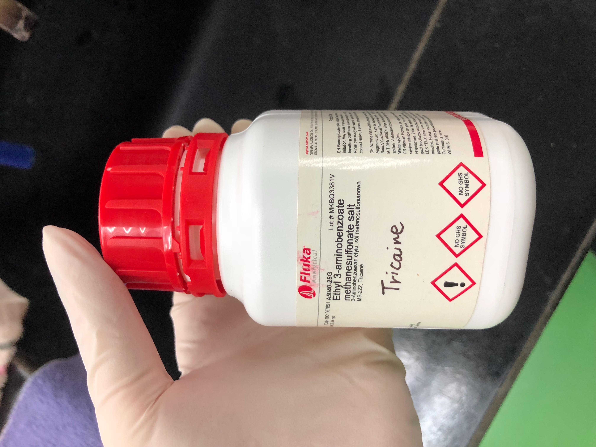
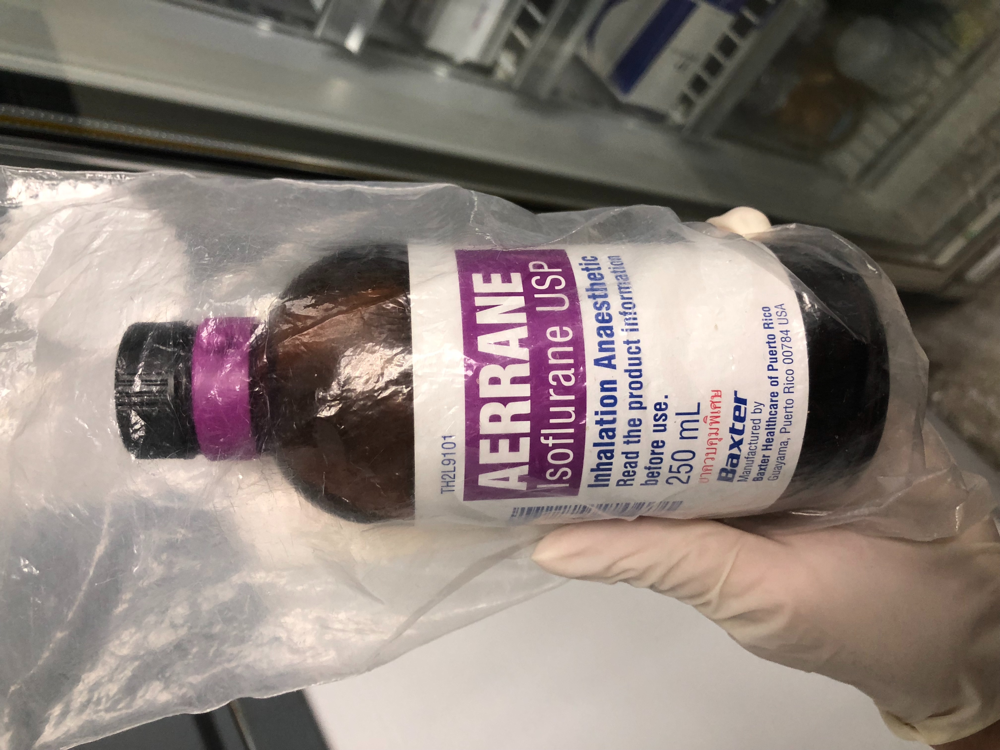

# Zebrafish-Project
Some information about Zebrafish project.

# Anesthesia Methods
* There two anesthetic solutions used in combination for adult Zebrafish.
1. Tricaine
* Pure Tricaine is strong enough to anesthesia children Zebrafish. Tricaine can be bought in [Sigma Taiwan](https://www.sigmaaldrich.com/catalog/search?term=Ethyl+3-aminobenzoate+methanesulfonate+salt&interface=Product%20Name&N=0+&mode=mode%20matchpartialmax&lang=en&region=TW&focus=productN=0%20220003048%20219853286%20219853264)
* Tricaine is also called "MS-222" or "Ethyl 3-aminobenzoate methanesulfonate salt"
2. Isoflurane
* Isoflurane is an anesthetic mostly used for mammals.
##The concentration is
```
193 mL water + 7 mL of 2000 ppm Tricaine + 120~150 uL Isoflurane
```
* 2000 ppm Tricaine is an solution of
```
1L water + 1mg Tricaine powder is 1 ppm.
Therefore, 1L water + 2000mg Tricaine powder is 2000 ppm.
40mL water + 80mg Tricaine powder is 2000 ppm.
```
* Use micro-pipette for Isoflurane. Wrong concentration would very likely to kill the fish.
* Wait around several minutes for the fish to enter stage 4 anesthesia.
* For more information please refer to the [paper](https://www.ncbi.nlm.nih.gov/pubmed/20807039)

# Anesthetic Images


